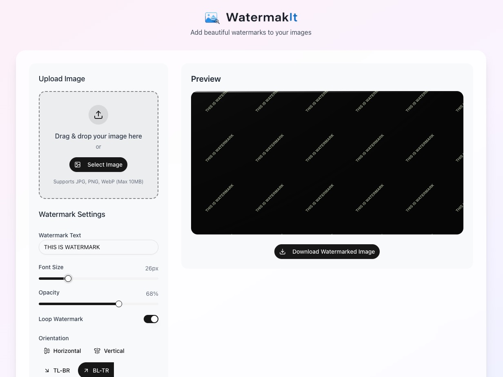

# WatermarkIt - Add Watermarks to Images

Welcome to **WatermarkIt**, a simple and intuitive tool for adding customizable watermarks to your images directly in the browser. Built with Next.js 15, React 19, and TypeScript.



## 🌟 Features

- **Easy Image Upload**: Drag and drop or select images from your device
- **Customizable Watermarks**: Adjust text, font size, color, and opacity
- **Multiple Orientations**: Horizontal, vertical, and diagonal watermark placement
- **Pattern Options**: Choose between single watermark or tiled pattern
- **Real-time Preview**: See changes instantly before downloading
- **Privacy Focused**: All processing happens in your browser - no server uploads

## 🛠️ Technologies Used

- **Next.js 15** - React framework with App Router
- **React 19** - UI library
- **TypeScript** - Type safety
- **Tailwind CSS** - Styling
- **Shadcn UI** - Component library (minimal subset)
- **HTML5 Canvas** - Image processing

## 🏁 Getting Started

### Prerequisites

- **Node.js**: Version 20.18.0 or higher
- **npm**: Package manager

### Installation

1. **Clone the Repository**:
    ```bash
    git clone https://github.com/fnmuharrom/watermarkit.git
    cd watermarkit
    ```

2. **Install Dependencies**:
    ```bash
    npm install
    ```

3. **Run Development Server**:
    ```bash
    npm run dev
    ```

4. **Build for Production**:
    ```bash
    npm run build
    ```

### 🐳 Docker Setup

To use Docker, make sure Docker is installed on your machine. Then, build and run the Docker container:

```bash
docker build . -t watermarkit

docker run -p 3000:3000 watermarkit
```

## 🚀 Usage

1. Open the application in your browser
2. Upload an image using drag & drop or the file selector
3. Customize your watermark:
   - Enter watermark text
   - Adjust font size and opacity
   - Select color from predefined options
   - Choose orientation (horizontal, vertical, diagonal)
   - Enable pattern mode for tiled watermarks
4. Preview your watermarked image
5. Click "Download Watermarked Image" to save

## 📁 Project Structure

```
src/
├── app/                 # Next.js app router pages
│   ├── page.tsx         # Main application page
│   └── layout.tsx       # Root layout
├── components/          
│   └── watermark-app/   # Watermark application components
│       ├── download-button.tsx
│       ├── image-uploader.tsx
│       ├── preview-canvas.tsx
│       ├── watermark-app.tsx
│       └── watermark-controls.tsx
└── lib/                 # Utility functions
    └── utils.ts
```

## 🎨 UI Components

This project uses a minimal subset of Shadcn UI components:
- Button
- Input
- Label
- Slider
- Switch
- ToggleGroup

All unused components have been removed to reduce bundle size.

## 🔒 Privacy

WatermarkIt processes all images directly in your browser using HTML5 Canvas. No images are uploaded to any server, ensuring your privacy and security.

## 🤝 Contributing

Contributions are welcome! Feel free to submit issues and pull requests.

## 📄 License

This project is licensed under the MIT License - see the [LICENSE](LICENSE) file for details.
